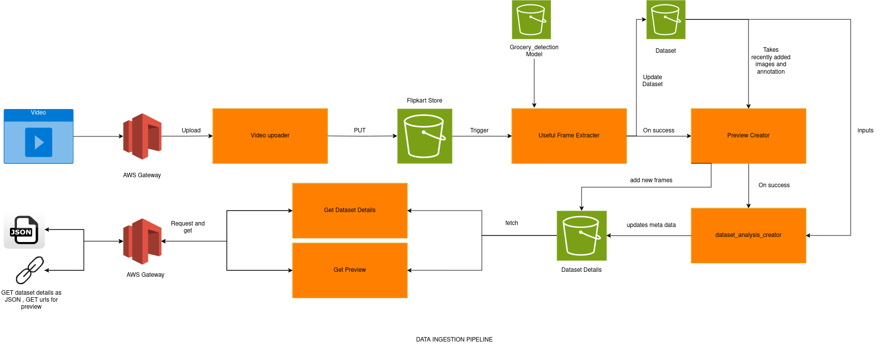

# **Data Ingestion Pipeline**  

  

## **Overview**  

The **Data Ingestion Pipeline** is a robust and scalable system designed to process and manage video data efficiently for AI-based grocery detection and analysis. It handles uploading, frame extraction, metadata management, and dataset updates, seamlessly integrating cloud storage and computing services.  

---

## **Key Components**  

1. **Video Uploader**  
   - Uploads videos through the **AWS Gateway** to cloud storage (e.g., Flipkart Store).  
   - Ensures secure and reliable video uploads with optimized PUT requests.  

2. **Useful Frame Extractor**  
   - Extracts meaningful frames from uploaded videos using the **Grocery Detection Model**.  
   - Adds the extracted frames to the dataset for further processing.  

3. **Preview Creator**  
   - Takes newly added frames and annotations to generate a preview of the dataset.  
   - Ensures proper visualization of the dataset after updates.  

4. **Dataset Analysis Creator**  
   - Analyzes the dataset's metadata, ensuring consistency and completeness.  
   - Updates metadata with details of newly added frames and annotations.  

5. **Dataset Details Management**  
   - Stores the dataset metadata in JSON format.  
   - Provides APIs to fetch dataset details and preview URLs.  

---

## **Pipeline Workflow**  

1. **Video Upload**  
   - Videos are uploaded via an AWS Gateway to cloud storage (e.g., Flipkart Store).  

2. **Frame Extraction**  
   - The Useful Frame Extractor is triggered to extract relevant frames.  
   - Frames are analyzed using the Grocery Detection Model and stored in the dataset.  

3. **Preview Generation**  
   - The Preview Creator visualizes the dataset by taking recently added frames and annotations.  

4. **Metadata Updates**  
   - Dataset metadata is fetched and updated dynamically, ensuring it reflects the latest additions.  

5. **APIs for Dataset Details**  
   - APIs allow fetching metadata or preview information in JSON format.  

---

## **System Architecture**  

The pipeline consists of several interconnected modules:  

- **Input**: Video files and metadata requests.  
- **Processing**: Frame extraction, preview creation, and metadata updates.  
- **Output**: Updated datasets, previews, and JSON responses for API requests.  

Refer to the diagram above for a visual representation of the architecture.  

---

## **Features**  

- **Scalable and Modular**: Easily add or replace components.  
- **Cloud Integration**: Built for seamless integration with AWS services.  
- **Real-time Updates**: Metadata and previews are updated dynamically as data is processed.  
- **API Support**: Provides endpoints for fetching dataset details and preview information.  

